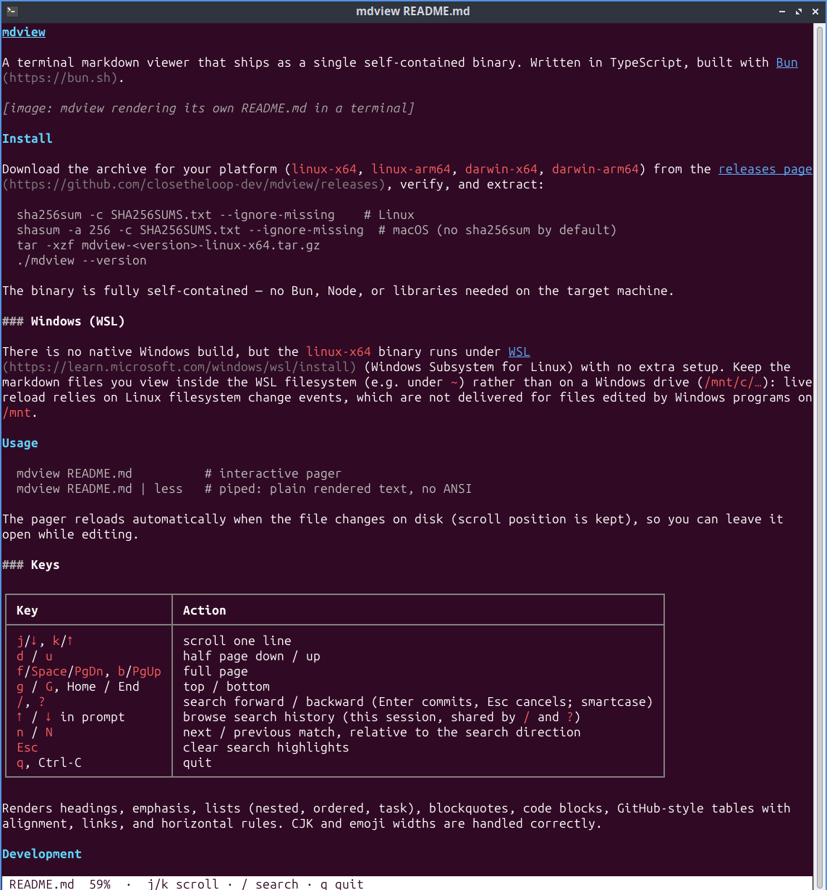

# mdview

A terminal markdown viewer that ships as a single self-contained binary.
Written in TypeScript, built with [Bun](https://bun.sh).



## Install

Download the archive for your platform (`linux-x64`, `linux-arm64`,
`darwin-x64`, `darwin-arm64`) from the
[releases page](https://github.com/closetheloop-dev/mdview/releases), verify,
and extract:

```sh
sha256sum -c SHA256SUMS.txt --ignore-missing    # Linux
shasum -a 256 -c SHA256SUMS.txt --ignore-missing  # macOS (no sha256sum by default)
tar -xzf mdview-<version>-linux-x64.tar.gz
./mdview --version
```

The binary is fully self-contained — no Bun, Node, or libraries needed on
the target machine.

### Windows (WSL)

There is no native Windows build, but the `linux-x64` binary runs under
[WSL](https://learn.microsoft.com/windows/wsl/install) (Windows Subsystem
for Linux) with no extra setup. Keep the markdown files you view inside the
WSL filesystem (e.g. under `~`) rather than on a Windows drive (`/mnt/c/…`):
live reload relies on Linux filesystem change events, which are not
delivered for files edited by Windows programs on `/mnt`.

## Usage

```sh
mdview README.md          # interactive pager
mdview README.md | less   # piped: plain rendered text, no ANSI
```

The pager reloads automatically when the file changes on disk (scroll
position is kept), so you can leave it open while editing.

### Keys

| Key | Action |
|---|---|
| `j`/`↓`, `k`/`↑` | scroll one line |
| `d` / `u` | half page down / up |
| `f`/`Space`/`PgDn`, `b`/`PgUp` | full page |
| `g` / `G`, Home / End | top / bottom |
| `/`, `?` | search forward / backward (Enter commits, Esc cancels; smartcase) |
| `↑` / `↓` in prompt | browse search history (this session, shared by `/` and `?`) |
| `n` / `N` | next / previous match, relative to the search direction |
| `Esc` | clear search highlights |
| `q`, Ctrl-C | quit |

Renders headings, emphasis, lists (nested, ordered, task), blockquotes,
code blocks, GitHub-style tables with alignment, links, and horizontal
rules. CJK and emoji widths are handled correctly.

## Development

Requires Bun (no Node/npm needed; version pinned in `.bun-version`).
Dependency versions are exact-pinned; install with `bun install
--frozen-lockfile` to reproduce the locked tree. The program's capability
surface (read the input file, watch its directory for changes, read
stdin, write stdout — no network, no subprocesses, no fs writes, no
eval) is enforced by
`tests/capabilities.test.ts`, which scans the shipped bundle on every test
run.

```sh
bun install
bun run dev tests/fixtures/kitchen-sink.md   # run from source
bun test                                     # unit tests
bun run typecheck                            # tsc --noEmit
bun run lint                                 # biome: lint + format check
bun run lint:fix                             # biome: apply fixes/formatting
bun run generate:folds                       # regen src/pager/case-folds.ts
                                             #   from data/CaseFolding.txt
bun run build                                # compile binaries into dist/
```

After cloning, enable the pre-commit gate (lint + tests) with:

```sh
ln -sf ../../scripts/pre-commit .git/hooks/pre-commit
```

`bun run build` cross-compiles all four release targets into `dist/`
(~90 MB each — the binary embeds the Bun runtime). CI builds use the
`Dockerfile` instead (same targets, pinned toolchain, lint + tests as
build gates); run it locally with:

```sh
docker buildx build --build-arg VERSION=v0.0.0-local \
  --target export -o type=local,dest=./out .
bash scripts/package-binaries.sh v0.0.0-local   # tar.gz per platform + SHA256SUMS.txt
```

## Architecture

```
file → marked.lexer() → tokens → renderBlocks(tokens, width) → Line[] → pager
```

Rendered lines are arrays of styled spans (`{text, style}`), serialized to
ANSI only at paint time; each line also keeps its plain text. Search runs
over the plain text and highlights by splitting spans at match boundaries,
so escape codes never need to be parsed back. The renderer is pure and unit
tested; the TUI layer (raw mode, alternate screen, key decoding) is kept
thin.

## License

[MIT](LICENSE)
